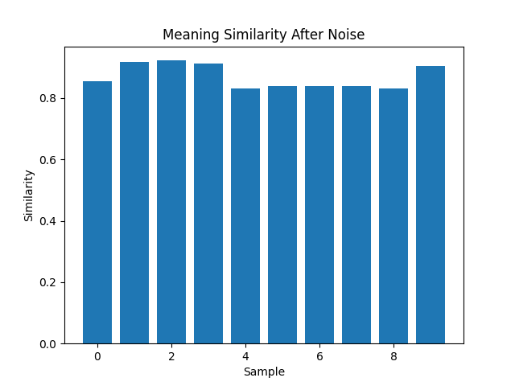
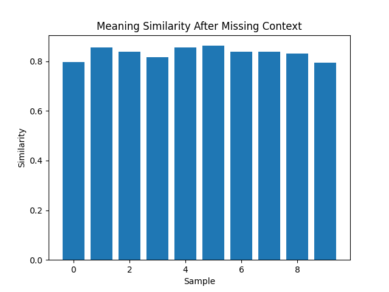
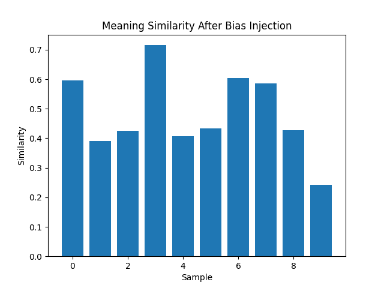
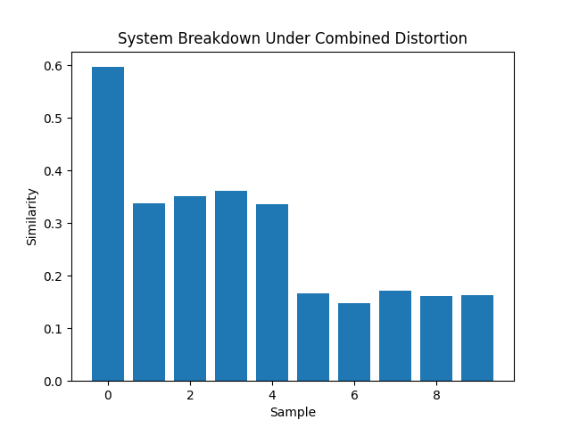
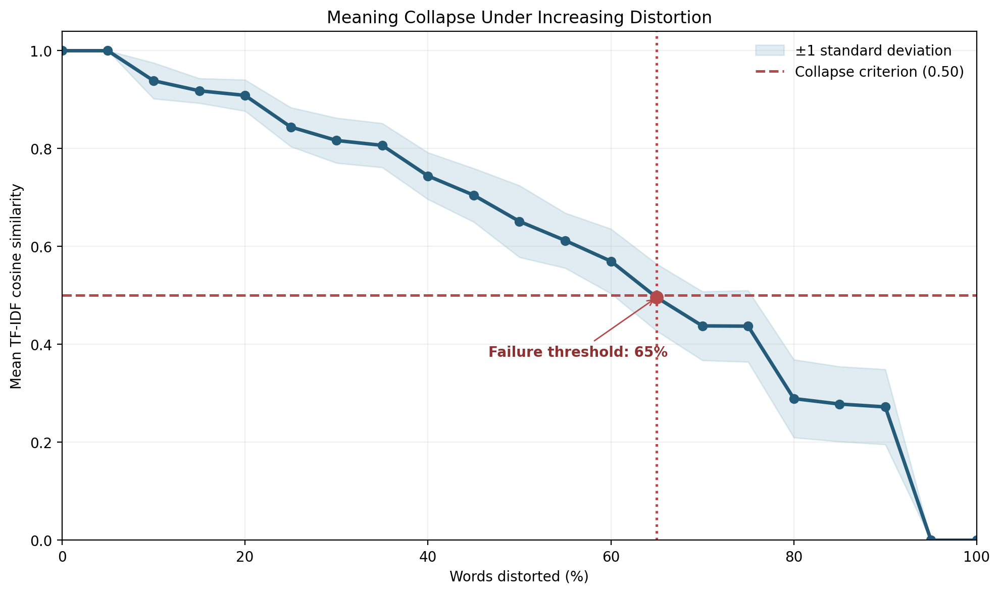

# signal-vs-noise

Understanding how meaning degrades when information is distorted.

Repository: https://github.com/cherikakaushal/signal-vs-noise

---

## Introduction

Real-world information systems rarely receive clean, complete, unbiased input.
Signals are mixed with noise, context disappears, and biased framing can shift
interpretation before a system visibly fails.

This project treats those failures as something measurable. Instead of asking
only whether text is correct or incorrect, it asks how much of the original
meaning survives under different types of distortion.

## Research Question

At what point does a sentence stop preserving its original meaning?

More specifically:

- How does random noise affect meaning?
- How quickly does meaning degrade when context is removed?
- Can biased language shift interpretation without total failure?
- Do combined distortions produce linear or non-linear breakdown?
- What distortion level marks the beginning of semantic collapse?

## Methodology

The experiments use short headline-style sentences from
[`data/headlines.csv`](data/headlines.csv). Each sentence is treated as the
clean reference signal.

Distorted versions are generated using three techniques:

- Noise injection: replace words with a neutral `noise` token.
- Missing context: remove words from the sentence.
- Bias injection: replace words with loaded terms such as `crisis`, `failure`,
  and `collapse`.

Meaning retention is approximated with TF-IDF vectors and cosine similarity.
Each distorted sentence is compared with its original sentence. A score near
`1.0` indicates high similarity; a score near `0.0` indicates that the lexical
signal has mostly collapsed.

For the threshold experiment, collapse is defined as the first tested distortion
level where mean similarity falls below `0.50`.

See [`analysis/methodology.md`](analysis/methodology.md) for the full
methodology.

## Experiments

### 1. Noise Injection

Random words are replaced with a neutral noise token.

Result: meaning degraded gradually because some original lexical signal usually
remained.

- Code: [`experiments/exp1_noise.py`](experiments/exp1_noise.py)
- Output: [`visuals/noise_similarity.png`](visuals/noise_similarity.png)

### 2. Missing Context

Words are removed from the sentence.

Result: meaning dropped rapidly because the sentence lost the evidence needed
to reconstruct the original message.

- Code: [`experiments/exp2_missing.py`](experiments/exp2_missing.py)
- Output: [`visuals/missing_context.png`](visuals/missing_context.png)

### 3. Bias Injection

Words are replaced with emotionally loaded terms.

Result: meaning shifted without complete failure. The sentence could remain
recognizable while its framing changed.

- Code: [`experiments/exp3_bias.py`](experiments/exp3_bias.py)
- Output: [`visuals/bias_effect.png`](visuals/bias_effect.png)

### 4. Combined Distortion

Noise, missing context, and bias are applied together.

Result: failure became non-linear. Multiple distortions reinforced one another
and produced sharper breakdown than any single distortion alone.

- Code: [`experiments/exp4_combined.py`](experiments/exp4_combined.py)
- Output: [`visuals/system_breakdown.png`](visuals/system_breakdown.png)

### 5. Failure Threshold

Distortion is increased from 0% to 100% in five-point steps, using repeated
seeded trials.

Result: system breakdown occurred around 65% distortion, the first tested level
where mean similarity fell below the 0.50 collapse criterion.

- Code: [`experiments/exp5_threshold.py`](experiments/exp5_threshold.py)
- Output: [`visuals/failure_threshold.png`](visuals/failure_threshold.png)

## Results

The experiments show that meaning does not fail in one uniform way. Some
distortions erode meaning slowly, while others remove essential context or shift
interpretation before the sentence appears fully broken.

Visual summaries:











## Key Findings

- Noise injection caused gradual degradation.
- Missing context caused rapid meaning loss.
- Bias injection changed framing without immediate collapse.
- Combined distortion produced non-linear failure.
- Threshold analysis found collapse around 65% distortion.

See [`analysis/findings.md`](analysis/findings.md) for the concise findings
summary.

## Project Structure

```text
signal-vs-noise/
├── analysis/
│   ├── findings.md
│   └── methodology.md
├── blogs/
│   ├── 01-signal-vs-noise.md
│   ├── 02-missing-context.md
│   ├── 03-bias-distortion.md
│   └── 04-system-breakdown.md
├── data/
│   └── headlines.csv
├── experiments/
│   ├── exp1_noise.py
│   ├── exp2_missing.py
│   ├── exp3_bias.py
│   ├── exp4_combined.py
│   └── exp5_threshold.py
├── visuals/
│   ├── bias_effect.png
│   ├── failure_threshold.png
│   ├── missing_context.png
│   ├── noise_similarity.png
│   └── system_breakdown.png
└── README.md
```

## Future Work

- Test larger and more diverse datasets.
- Compare lexical similarity with embedding-based semantic similarity.
- Add interactive controls for distortion type and intensity.
- Track sentence-level failure cases, not only aggregate averages.
- Extend the project into a small dashboard for system behavior analysis.
